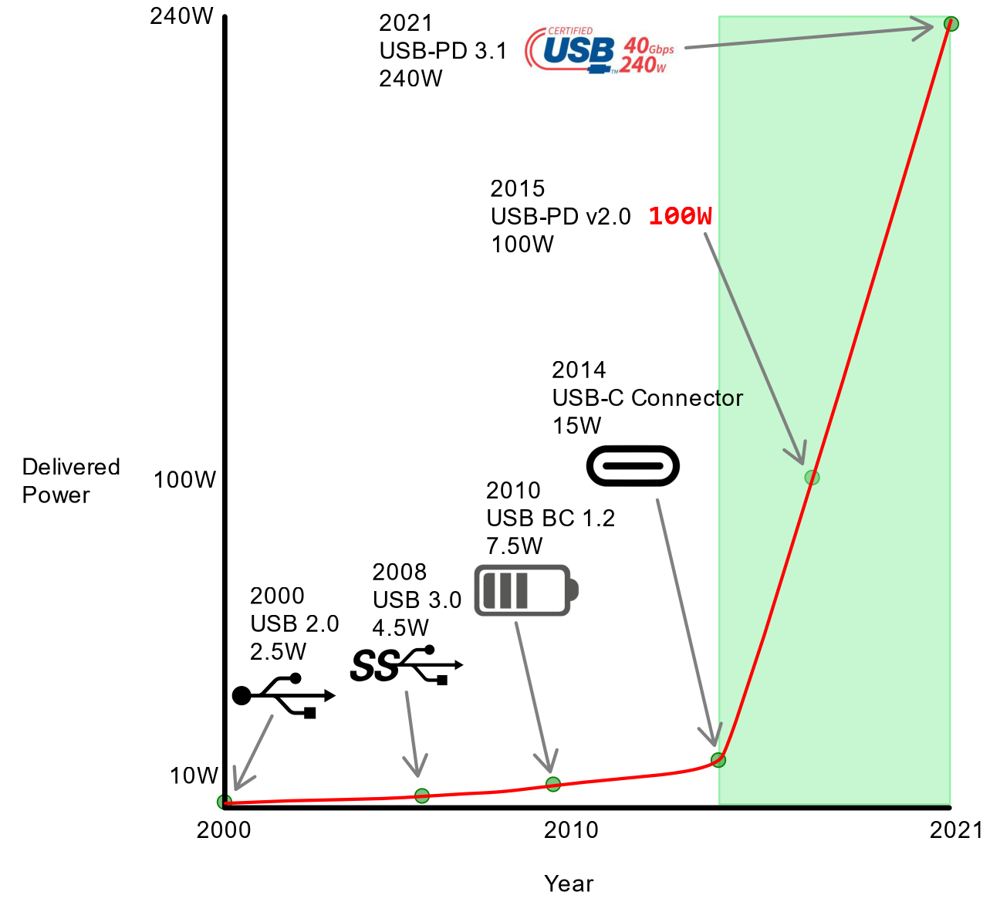
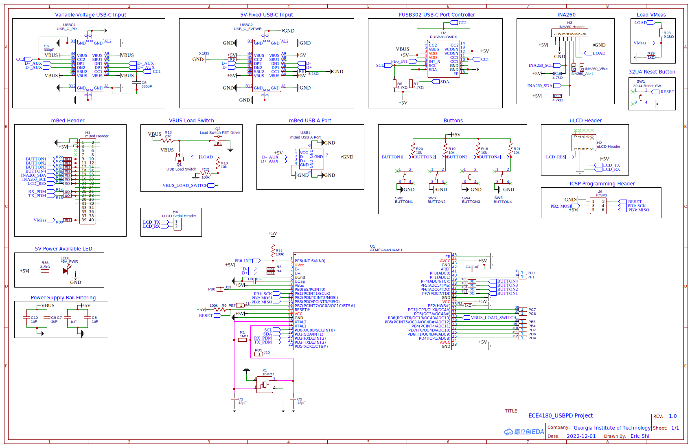
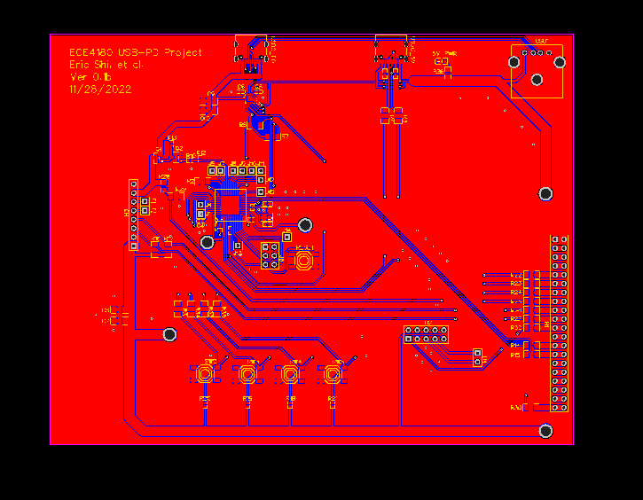

# ECE 4180 Project: USB-PD Variable Power Supply 

**Team members: Eric Shi, Ziyu Liu, Tomas Gowens**

**Geogia Tech**

**Watch the Demo:**
https://www.youtube.com/watch?v=Ixi4_sykFqE

## Table of Content 
* [Background](#background)
* [Project Description](#project-description)
* [Repo Navigatation](#repo-navigation)
* [Parts List](#parts-list)
* [Schematic](#shcematic)
* [PCB Layout](#pcb-layout)
* [Connection Guide](#connection-guide)
* [Source Code](#source-code)
* [Future Work](#future-work)


## Background


When USB was first introduced, it was intended to be a general-purpose data bus. Power delivery was not seriously considered in USB's original conception.
USB revisions prior to and including USB 2.0 were able to deliver 500mA @ 5V for connected devices (2.5W). This is enough power to power a mouse or keyboard, but not enough power to charge batteries.
When USB 3.0 was introduced in 2008, the 500mA current capability was increased to 900mA, allowing for 4.5W of power delivery. This allowed some higher-power devices such as bus-powered hard drives to operate.

To address the growing demand on the power capabilities of the USB connector as mobile smartphones proliferated through the market, in 2010, the USB Battery Charging (BC) 1.2
specification was released. USB BC 1.2 uses the same USB-A connector as all generations of USB prior to and including USB 3.0. USB BC 1.2 added support for a 1.5A Charging Downstream Port (CDP)
mode, allowing for 7.5W of power to be drawn by a connected device. This was the standard for a long time, all the way until 2014.

In 2014, the USB-C connctor was debuted, and it natively supported a 3A mode, still at 5V, allowing for up to 15W of power to be sourced.
However, the USB-C connector was holding some secrets: the CC and VCONN pins/lines in the connector.

These lines allow a power source, power sink, and the interconnecting cable to communicate with each other over a simple Biphase Mark Code (BMC) signal. In 2015, the first widespread revision of USB Power Delivery (USB-PD)
was introduced: USB-PD 2.0. USB-PD allows power sources and sinks to negotiate voltages with each other, supporting up to 20V @ 5A (100W) with a supported cable. In 2021, an updated version of this standard, USB-PD 3.1, was released
with support for Extended Power Range (EPR) voltages, which range from 20V to 48V, still at 5A, for a maximum theoretical power delivery capacity of 240W.

## Project Description
Our goal was to create a mini "benchtop-style" power supply that offloads the voltage and current regulation to a USB Power Delivery compliant AC-DC adapter. This allows our power supply unit to be compact and efficient, allowing it to be very portable.
We have created a custom PCB to implement our project. 

Most USB-C laptop chargers support all the voltage ranges supported with our project. Our project currently supports 5V, 9V, 12V, 15V, and 20V outputs.

Our project is inspired from the lab bench power supplies available in Electrical Engineering Labratories: it's nice to be able to produce any desired voltage on-demand. This greatly speeds up the testing and debugging of circuits.
As college students with modern laptops, all of the team members already carry around efficient USB-C PD chargers that have extremely high power densities. Why not tap into this to build a portable "benchtop" power supply?

The project incorperates a Texas Instruments INA260 Digital Current/Voltage/Power monitor. This allows us to accurately sense output voltage and current and present that information on a readout, just like with a real benchtop supply.
We use an OnSemi FUSB302B as our USB-C PHY port controller. The FUSB302B has an I2C interface to the host, which allows us to manage the PHY in software.
We use an Atmel Atmega 32U4 as a dedicated coprocessor to handle communications with the PHY and manage the USB-CC communication link. A serial interface is used between the Atmega 32U4 and the mBed.
A uLCD-144G2 LCD display is used to display relevant information to the user. The LCD is connected to the mBed via UART connection.
A software deboucned button (via PinDetect) is used as a human interface to allow voltage selection.

**UPDATE: Tightened COVID policy in China has delayed the shipment of our PCB. We have since assembled a project with identical functionality using off-the-shelf parts on a breadboard as a contingency plan.
The below information has been edited to reflect our backup project, but schematics and PCB layouts for the original PCB were left in place.

## Repo Navigation
[4DGL-uLCD-SE](4DGL-uLCD-SE), [INA260](INA260), [mbed](mbed) are three library folders that include required API for this project. 

[main.cpp](main.cpp) contains the main logic of controlling the mini power supply using mbed command.

[Schematic](Schematic_ECE4180_USBPD_2022-12-01.svg) shows the layout of the project's customized break out board. 

## Parts List 
* Mbed LPC1768
* LC Display: uLCD-144G2
* INA260 Current Sensor 
* PD Trigger 
* 3 Relays 
* 2 Power MOSFET
* External Load Power Resistor
* Type-C Cable 
* Jumper Wires 

## Schematic 


## PCB Layout


## Source Code
```
#include "mbed.h"
#include "INA260.hpp"
#include "uLCD_4DGL.h"
#include "PinDetect.h"


I2C i2c(p28, p27);
INA260 VCmonitor(i2c);
DigitalIn ALT(p29);            // Alert pin
uLCD_4DGL uLCD(p13, p14, p12); // serial tx, serial rx, reset pin;

// USB PD Trigger Actuators: S1, S2, S3
DigitalOut s1(p18);
DigitalOut s2(p19);
DigitalOut s3(p20);

DigitalOut led1(LED1);
DigitalOut led2(LED2);
DigitalOut led3(LED3);
DigitalOut led4(LED4);

// Button In
PinDetect pb(p8, PullUp);


int vReq = 5;

void buttonPressed(void)
{
    switch (vReq)
    {
    case 5:
        vReq = 9;
        s1 = 1;
        s2 = 1;
        s3 = 1;
        
        
        led1 = 1;
        led2 = 0;
        led3 = 0;
        led4 = 0;
        
        break;

    case 9:
        vReq = 12;
        s1 = 1;
        s2 = 0;
        s3 = 1;
        
        led1 = 1;
        led2 = 1;
        led3 = 0;
        led4 = 0;
        break;

    case 12:
        vReq = 15;
        s1 = 0;
        s2 = 0;
        s3 = 1;
        
        led1 = 1;
        led2 = 1;
        led3 = 1;
        led4 = 0;
        break;

    case 15:
        vReq = 20;
        s1 = 0;
        s2 = 1;
        s3 = 1;
        
        led1 = 1;
        led2 = 1;
        led3 = 1;
        led4 = 1;
        break;

    case 20:
        vReq = 5;
        s1 = 1;
        s2 = 1;
        s3 = 0;
        
        led1 = 0;
        led2 = 0;
        led3 = 0;
        led4 = 0;
        break;
    }
}

int main() {
    s1 = 1;
    s2 = 1;
    s3 = 0;
    
    led1 = 0;
    led2 = 0;
    led3 = 0;
    led4 = 0;

    double V, C, P;
    int count = 1;
    // Sets 4 samples average and sampling time for voltage and current to 8.244ms
    VCmonitor.setConfig(0x0600 | 0x01C0 | 0x0038 | 0x0007); // INA260_CONFIG_AVGRANGE_64|INA260_CONFIG_BVOLTAGETIME_8244US|INA260_CONFIG_SCURRENTTIME_8244US|INA260_CONFIG_MODE_SANDBVOLT_CONTINUOUS
    VCmonitor.setAlert(0x8001);                                           // set current value as alert, latch alert pin
    VCmonitor.setLim(0x8);                                                // set limit to 10mA (10/1.25)

    wait_ms(3000);

    uLCD.text_width(2);
    uLCD.text_height(2);

    uLCD.color(BLUE);
    uLCD.locate(0, 3);
    uLCD.printf("Meas V");
    uLCD.locate(0, 6);
    uLCD.printf("Meas I");
    uLCD.locate(0, 2);
    uLCD.color(WHITE);
    uLCD.printf("---------");

    while (1) {
        
        if (!pb) {
            buttonPressed();
        }
        
        // get ina260 settings0
        if ((VCmonitor.getVoltage(&V) == 0) && (VCmonitor.getCurrent(&C) == 0) && (VCmonitor.getPower(&P) == 0)) {
            uLCD.text_width(2);
            uLCD.text_height(2);
            uLCD.locate(0, 0);
            uLCD.color(BLUE);
            uLCD.printf("Req V");
            
            uLCD.text_width(2);
            uLCD.text_height(2);
            uLCD.color(WHITE);

            uLCD.locate(0, 1);
            uLCD.printf("\r%d V ", vReq);

            uLCD.text_width(2);
            uLCD.text_height(2);
            uLCD.locate(0, 4);
            uLCD.color(WHITE);
            uLCD.printf("\r%.2f V ", V);
            uLCD.locate(0, 7);
            uLCD.color(WHITE);
            uLCD.printf("\r%.1f mA  ", C);
        }
        count++;

        wait_ms(100);
    }
}
```
## Future Work
Our power supply currently only supports 5, 9, 12, 15, 20V Fixed PDO output. In the future we plan to implement support for USB-PD PPS (Programmable Power Supply), which would allow us to output from 3.3V to 21V with 200mV resolution.
This would also enable us to perform output current regulation from 0A to 5A with 50mA resolution. In this case, we would most likely replace the button with a Rotary Pulse Generator (RPG) or linear potentiometer to allow fine adjustments.
